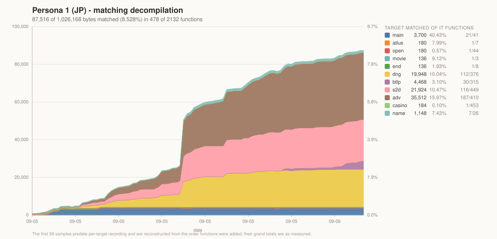

# Persona 1 (JP, SLPS-00500) — matching decompilation

*Megami Ibunroku Persona* for the PlayStation, decompiled to C that compiles
back to the original bytes. JP is the base. Persona 2 (Innocent Sin / Eternal
Punishment) is a later goal and shares this engine, which is why the PSX release
was chosen over the 1999 JP PC port — the port flattens the overlay set,
duplicates functions per overlay, and shares almost nothing with P2. It is kept
as a reference oracle, nothing more.

## Status

All 11 targets rebuild **byte-identically** from split asm (`make check`), which
is the ground truth that the split is lossless.

| target | binary | vram |
|---|---|---|
| `main` | `SLPS_005.00` | `0x80010000` |
| `atlus` `open` `movie` `end` | `EXE/*.EXE` | `0x80080000` |
| `dng` `btlp` `s2d` `adv` `casino` `name` | `*.BIN` overlays | `0x800643a0` |

6,347 functions are split out. `tools/progress.py` re-verifies every one that
has been decompiled and counts only a 100% objdiff as matched; `--record`
appends a row to `progress.json` and redraws the chart above.

The work so far is concentrated in the three big overlays — `adv` (the field and
event scenes), `dng` (the first-person dungeon) and `s2d` — because they share
most of their code with each other and, eventually, with Persona 2.

A decompiled function only joins the build once its splat subsegment is flipped
from `asm` to `c`. Until then candidates live in `src/` and are verified
standalone, so `make check` stays a true asm-rebuild test.

## Toolchain

- `bin/cc1-psx-26` — Psy-Q cc1, self-identifies as `GNU C 2.6.3 [AL 1.1, MM 40] Sony Playstation`
- `tools/maspsx` — replicates ASPSX so GNU as can assemble Psy-Q compiler output
- `binutils-mipsel-linux-gnu` — assembler/linker (`elf32ltsmip`)
- `splat` + `spimdisasm` — splitting
- `include/psyq/` — Psy-Q SDK headers
- `bin/objdiff-cli`, `tools/decomp-permuter`, `tools/m2c`, `tools/asm-differ`

Everything runs natively on Linux; no Wine or DOSBox is needed.

## Build

    make split     # regenerate symbols from Ghidra, then split all targets
    make           # assemble + link all targets
    make check     # byte-compare every target against the disc original
    make progress  # re-verify every decompiled function

`CLAUDE.md` is the operating manual: how to pick a function, score a candidate,
name what it touches, and the compiler behaviours that have already cost time
here. It is worth reading before the first match.

## Shared code

`SLPS_005.00` stays resident, so the overlays call its helpers rather than
carrying copies. The four sub-EXEs are linked standalone, though, and the
overlays each compile in their own copy of a handful of routines — so the *same*
function shows up at several addresses. `tools/find_dups.py` finds those: it
masks `j`/`jal` targets and address immediates, which is everything the linker
moves, and groups what is left.

    tools/find_dups.py                    # every cross-target group
    tools/find_dups.py main func_80012B2C # twins of one function

There are 276 such groups, 164 KB of code beyond the first copy. One matching
source covers every copy, so `src/p1-jp/common/` holds the sources known to be
shared and `config/p1-jp/decomp.txt` points several targets at them. Where one
overlay reaches a different address, it keeps its own copy at the same relative
path under its own target directory.

## How the split is driven

spimdisasm's heuristics were not good enough here — `.text` has code and data
interleaved, and it merged distinct functions. The split is therefore driven by
**Ghidra's** analysis:

1. `ghidra/ExportCodeMap.py` dumps per-function extents, defined data and names
   for each program, with overlay blocks as separate address spaces
2. `tools/gen_symbols.py` turns that into splat `symbol_addrs` files. Interleaved
   data cannot be a splat `data` subsegment — splat would move it into `.data`
   after `.text` and change the byte order — so data is emitted as inline
   symbols with explicit `type:`/`size:`
3. `tools/gen_splat_configs.py` writes one splat config per target
4. `tools/gen_undefined.py` resolves references landing inside large data runs

Three things had to be handled to get a clean split, all in `gen_symbols.py`:

- **4-byte alignment.** Ghidra occasionally reports a degenerate 1-byte function
  body, which produced a misaligned data run and made spimdisasm bail on
  everything after it (functions went 1221 → 7).
- **Alignment padding.** Ghidra excludes trailing padding from a function body,
  leaving 4–16 byte islands. Emitting those as data runs demoted every following
  function to a plain label. They are absorbed into the preceding function.
- **Degenerate stubs.** Functions under 8 bytes are dropped so they fall into the
  data runs.

Overlays additionally need `.data` ordered *first* (their id dword is at file
offset 0), `subalign: 4`, and `ld_align_section_vram_end: False` — otherwise
splat pads each section to 16 and the file comes out 12–24 bytes too long.

## Names

Names live in Ghidra, which is the only copy, and flow outwards into
`config/p1-jp/*.names.ld`. Every asserted name is backed by something observed —
an SDK call it wraps, a constant it writes, a sentinel value, how a caller uses
the result — and that evidence is recorded as a plate comment on the symbol.
`SndSeqPlay`, for instance, calls `SsSetNck`/`SsSeqOpen`/`SsSeqSetVol`/
`SsSeqPlay` over data at `0x80180000`, which is where `main` loads `OPEN.BIN`:
**OPEN.BIN is the sequence bank**.

Nothing in `src/` uses an address-derived name. If a name cannot be justified,
the function waits.

## Notes

- The PSX SDK should **not** be decompiled. Link the real Psy-Q libraries via
  `psyq-obj-parser` and they match for free. Ghidra's signature database
  identifies which objects are present, which also keeps SDK code out of the
  candidate list — `tools/pick_candidates.py` filters anything Ghidra has named,
  after an early near-miss where `PRNT_OBJ_594` (Psy-Q `printf` internals) came
  top of the list.
- See `docs/p1-memory-map.md` for the overlay mechanism and program structure.
- Disc images and extracted game data live in `scratch/`, which is not tracked.
